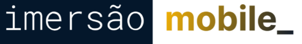
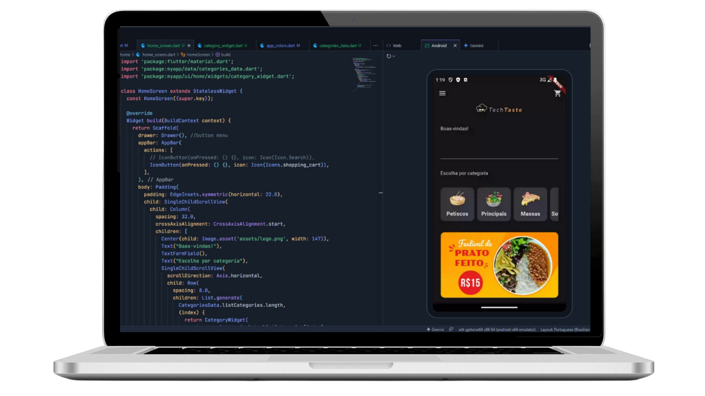
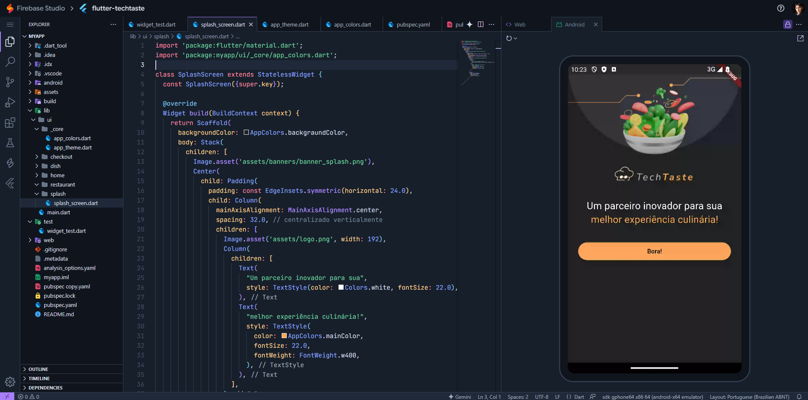
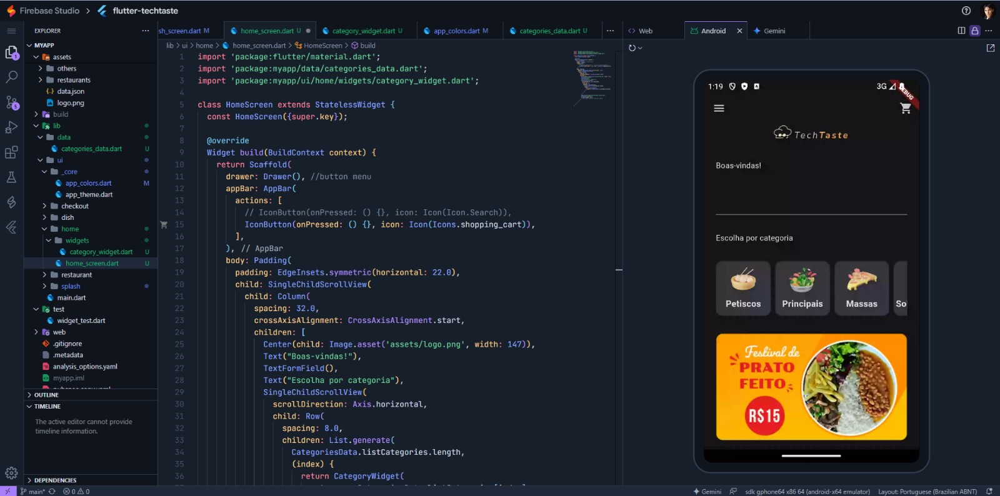

<!---------- Title/ Logo -------------->
<h1 align="center">
  
</h1>

<!-- ------- Ancoras --------------->
<p align="center">
  <a href="#-sobre">Sobre</a>&nbsp;&nbsp;&nbsp;|&nbsp;&nbsp;&nbsp;
  <a href="#-projeto">Projeto</a>&nbsp;&nbsp;&nbsp;|&nbsp;&nbsp;&nbsp;
  <a href="#-telas">Telas</a>&nbsp;&nbsp;&nbsp;|&nbsp;&nbsp;&nbsp;
  <a href="#-tecnologias">Tecnologias</a>&nbsp;&nbsp;&nbsp;|&nbsp;&nbsp;&nbsp;
  <a href="#-licença">Licença</a>
</p>

<!---------- Badges ----------------->  
<!--p align="center">
   
  
  
  
  <!----(4953b8)--BlueDark -->
  <!----(49AA26)--Green -->
  <!----(008ed6)--Blue -->
  <!----(3292a6)--BlueMedium-->
  <!----(015F43)--GreenMedium-->
  <!----(BE920C)--LaranjaMedium-->
<!--/p-->

<!-- Ajustes no confluto de visuação do GitHub -->
<!---------- Badges ----------------->
<p align="center">
  
  
  
  
</p>

<br>
<!---------- showcase  ----------------->  
<p align="center">
  
</p>

 <!----- Acess Deploy Demonstration-->
 <!--h5 align="center">
    🎬 Clique Aqui: &nbsp; <a href="https://event-platform-gold.vercel.app/">  Visualizar Demonstração </a> 
 </h5 -->


<!----- Description ------------------>
## 🔖 Sobre

 &nbsp;&nbsp;&nbsp;&nbsp;Este projeto é parte do evento que participei o **Imersão Mobile Alura** da plataforma de ensino: [Alura Cursos](https://www.alura.com.br/). &nbsp;&nbsp; Foi uma semana de maratona de estudos sobre desenvolvimento Flutter na edição inicial #imersaomobile. 
 
 &nbsp;&nbsp;&nbsp;&nbsp;O projeto denominado **Flutter_Techtaste**, teve como objetivo criar um App. aplicação Mobile, modelo de um aplicativo que executa pedido de compras de refeições por estabelecimentos. 
 
  
  <br>

  ## 💻 Projeto
  
 &nbsp;&nbsp;&nbsp;&nbsp;A Construção e desenvolvimento foi através de conceitos de arquitetura e plugins da linguagem **Flutter**, utilizando como ferramenta de [idx.google + Firebase Studio](https://idx.google.com/) - Ambiente de desenvolvimento integrado (IDE) online assistido por Inteligência Artificial Gemini, desenvolvido pela Google. É um editor de código na web que permite aos desenvolvedores construir e testar aplicativos multi-plataforma e full-stack, tudo dentro de um único ambiente na nuvem. 
 
 
   Durante a **Imersão Mobile**, foi possivel mergulhar em **HTML** e **Flutter**, conhecer um pouco mais do framework: [Flutter](https://flutter.dev/), aprendendo a desenvolver este projeto mobile como exemplo prático para ampliar os conhecimentos nesta técnologia, seguindo algumas das seguintes etapas.

    1️⃣ Tela Splash e Home (estrutura inicial do app)
    Ambiente: Configuração no IDX.

    Importações: Assets, imagens e estilos.
    Widgets usados: Scaffold, Stack, Column, Image, Text, ElevatedButton.

    Personalização:
    Criação dos arquivos AppColor e AppTheme para organizar cores e estilos.

    2️⃣ Home completa e navegação
    Navegação: Implementação da AppBar, Drawer e formulário de busca.

    Modularização:
    Criação dos widgets reutilizáveis: CategoryWidget e RestaurantWidget.

    Dinamismo:
    Uso de model e provider para carregar dados de restaurantes dinamicamente.

    3️⃣ Tela de detalhes e pedidos
    Detalhes dos restaurantes: Exibição dos pratos associados.

    Carrinho de compras:
    Uso de Provider e Badges para gerenciar e exibir a quantidade de itens.

    AppBar customizada:
    Com ícone de sacola (badge) com número de itens.

    Checkout:
    Criação da tela e lógica de totalização do pedido.
  
 
<br>

 ###### **Evento :** Imersão Mobile da Alura Edição - [Alura Cursos](https://www.alura.com.br/)
 ###### **Instrutor :** Equipe Alura
<br>

<!----- Showcase Screens Shot------------------>
## 💻 **Telas**

<div align="center">
  
</div>
<br>
<div align="center">
  
</div>
<br>
<br>

<!----- Pré Requisitos ---------------------------->

## 🚀 Tecnologias

- [HTML5](https://pt.wikipedia.org/wiki/HTML5) - Hyper Text Markup Language - linguagem de marcação de hipertexto.
- [Flutter](https://flutter.dev/) - framework de código aberto criado pela Google para desenvolver aplicativos para várias plataformas (móvel, web e desktop) com uma única base de código. 
- [FireBase Studio](https://firebase.google.com/docs/studio?hl=pt-br) - Ambiente de desenvolvimento agêntico baseado na nuvem que ajuda você a criar e enviar aplicativos com IA de pilha completa com qualidade.
- [Idx.google + Firebase Studio](https://idx.google.com/) - Ambiente de desenvolvimento integrado (IDE) online assistido por Inteligência Artificial Gemini, desenvolvido pela Google. É um editor de código na web que permite aos desenvolvedores construir e testar aplicativos multi-plataforma e full-stack, tudo dentro de um único ambiente na nuvem. 
- [VS Code](https://code.visualstudio.com/) - Editor de desenvolvimento de aplicações web.

<br>

## Getting Started

This project is a starting point for a Flutter application.

A few resources to get you started if this is your first Flutter project:

- [Lab: Write your first Flutter app](https://docs.flutter.dev/get-started/codelab)
- [Cookbook: Useful Flutter samples](https://docs.flutter.dev/cookbook)

For help getting started with Flutter development, view the
[online documentation](https://docs.flutter.dev/), which offers tutorials,
samples, guidance on mobile development, and a full API reference.

## 📝 Licença
<a href="https://opensource.org/licenses/MIT">
    
</a>

 &nbsp;&nbsp;&nbsp;&nbsp;Esse projeto está sob a licença MIT. Veja o arquivo [LICENSE](https://opensource.org/licenses/MIT) para mais detalhes.

 <br>

<!----- Configurations ---------------------------->
 ## 📌 Instruções : 

Para iniciar o Servidor da aplicação em localhost, use o comando: **flutter run** , ou então pode acessar pelo navegador executando clone para uma caonta **_https://idx.google.com/_** , clicando no botão:  **Hard Restart**, na area do emulador Android.

<br>

## 📁 Como Baixar o Projeto

```bash
  # Clonar o repósitorio
  $ git clone https://github.com/alxlima/flutter_techtaste.git

  # Entrar no diretório
  $ cd c:/fontes/projetos/flutter_techtaste
  
  # Iniciar o Projeto
  $ fluter run
```
#
 Desenvolvido 🚀 por: ***_Alex Sandro da Silva lima_***


[](https://www.linkedin.com/in/alex-sandro-da-silva-lima-8b297839/) 
[](mailto:alex_lima2013@hotmail.com)

